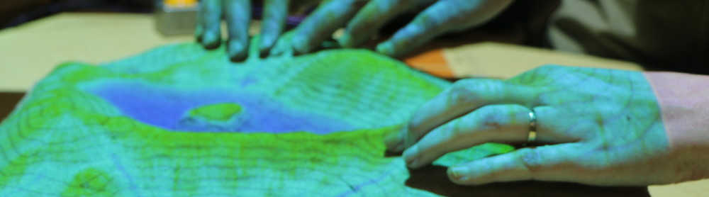
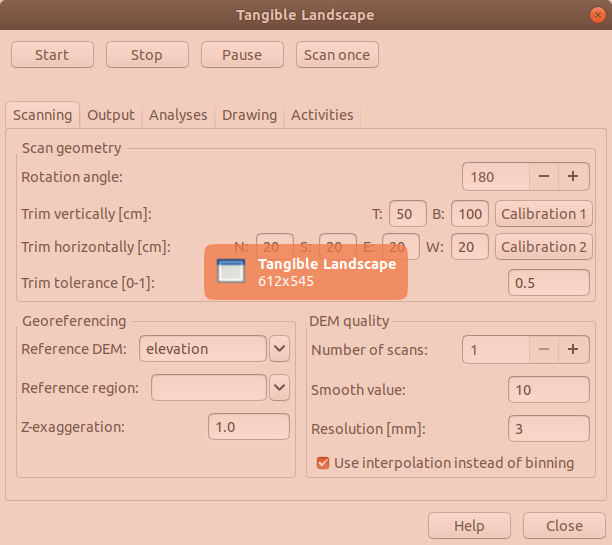

Tangible Landscape
==================

Tangible Landscape is an open source tangible interface for geospatial modeling powered by GRASS GIS. Tangible Landscape couples a physical model with a digital model of a landscape so that you can naturally feel, reshape, and interact with the landscape. This makes geographic information systems (GIS) far more intuitive and accessible for beginners, empowers geospatial experts, and creates new opportunities for developers.

This repository contains Tangible Landscape plugin for GRASS GIS, which allows
a real-time feedback cycle of interaction, 3D scanning, point cloud processing, geospatial computation and projection

Installation:
----------------------------------
We support installation on Ubuntu 18.04. Tangible Landscape requires Microsoft Kinect for Xbox (v2) or Kinect for Azure. Software dependencies include:

-   GRASS GIS >= 8.2
-   GRASS GIS addon [r.in.kinect](https://github.com/ncsu-osgeorel/r.in.kinect): choose version depending on your sensor.
-   Python package [watchdog](https://pypi.python.org/pypi/watchdog), optionally [matplotlib](https://matplotlib.org/)

1. Make a folder where all the dependencies will be compiled:

       mkdir tangiblelandscape && cd tangiblelandscape

2. Download [one of the install scripts](https://github.com/tangible-landscape/tangible-landscape-install) based on your sensor to that folder and run it:

       sh install_Ubuntu-20.04_k4a.sh

    It will ask you for administrator password. You need to be online to download all dependencies. After finishing the process, log out and log in.

3. Find GRASS GIS in Dash and start it. Create a new GRASS Location or use an existing one, and when GRASS Layer Manager opens, go to tab Console and type:

       g.gui.tangible

Resources
--------
 - Visit [Tangible Landscape website](https://tangible-landscape.github.io) for overview and applications
 - Go to [Tangible Landscape wiki](https://github.com/tangible-landscape/grass-tangible-landscape/wiki)
 to see how to build and run Tangible Landscape and how to develop your applications for it
 - Check out [Community](https://github.com/tangible-landscape/grass-tangible-landscape/wiki/Community)
 page to see who is using Tangible Landscape
 - Read our book [Tangible Modeling with Open Source GIS](https://link.springer.com/book/10.1007%2F978-3-319-89303-7) showing various modeling applications and methods
 - See [published research](https://tangible-landscape.github.io/publications.html)

Authors
--------
Anna Petrasova (lead developer), Vaclav Petras, Payam Tabrizian, Brendan Harmon, Helena Mitasova

[NCSU GeoForAll Laboratory](https://geospatial.ncsu.edu/geoforall/) at the [Center for Geospatial Analytics](https://cnr.ncsu.edu/geospatial/), NCSU

How to cite
-----------
If you are using Tangible Landscape in an academic context, please cite our work:

> Petrasova, A., Harmon, B., Petras, V., Tabrizian, P., & Mitasova, H. (2018). Tangible Modeling with Open Source GIS. Second edition. Springer International Publishing. eBook ISBN: 978-3-319-89303-7, Hardcover ISBN: 978-3-319-89302-0, https://doi.org/10.1007/978-3-319-89303-7.
